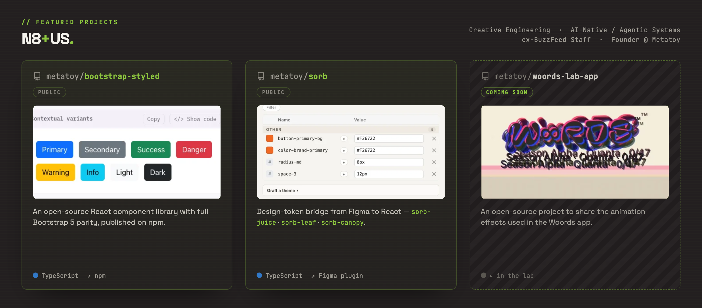

I'm a software engineer and founder with 30 years of experience working with companies including BuzzFeed, Target, Best Buy, and BMW. I work at the seam where design meets engineering, and for the last couple of years I've been building applied AI and agentic systems in production.

**A couple of things I've built:**

- **[@metatoy/bootstrap-styled](https://www.npmjs.com/package/@metatoy/bootstrap-styled)** — An open-source React + styled-components component library with full Bootstrap 5 parity. MIT licensed, published on npm.
- **[@sorb/tap](https://github.com/metatoy/sorb-tap)** — An open-source MCP server for design tokens: point AI agents at a DTCG file or a Sorb project and they can list, resolve, and trace tokens through real alias chains. MIT licensed.
- **[@metatoy/woords-lab-app](https://github.com/metatoy/woords-lab-app)** — An open-source project sharing the animation effects used in the woords app.

I'm consulting and taking contract work through [N8+US](https://n8plusus.com), and I'm open to the right full-time fit.

📫 **hello@metatoy.com** · [LinkedIn](https://linkedin.com/in/nathanhunsaker) · [metatoy.com](https://metatoy.com) · [portfolio](https://n8plusus.com/portfolio)
